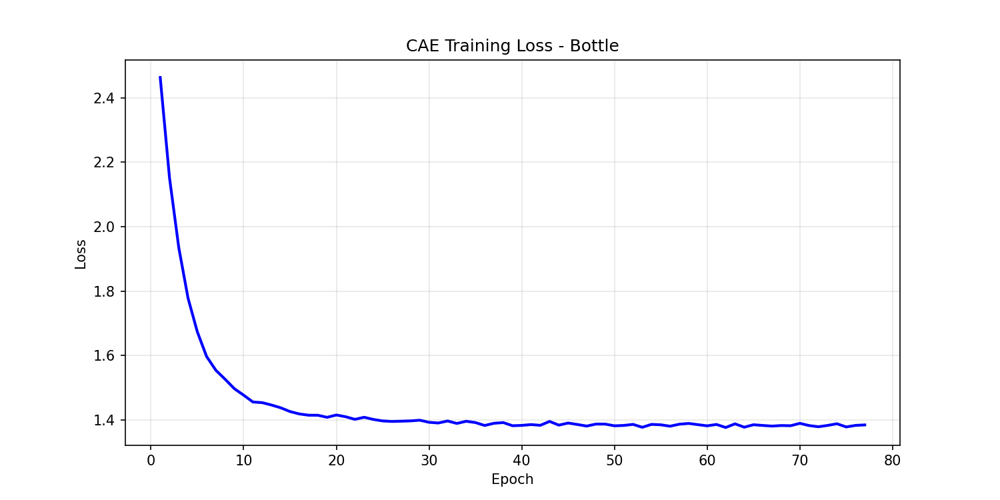
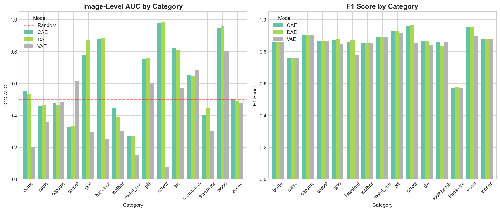
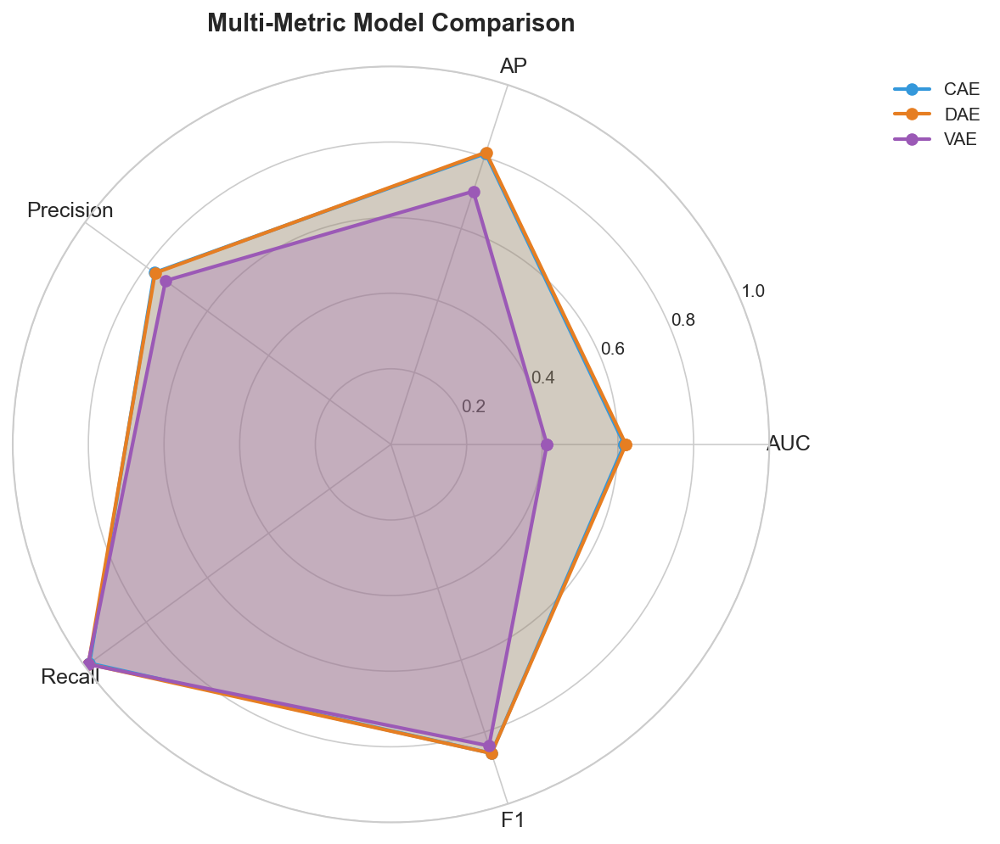
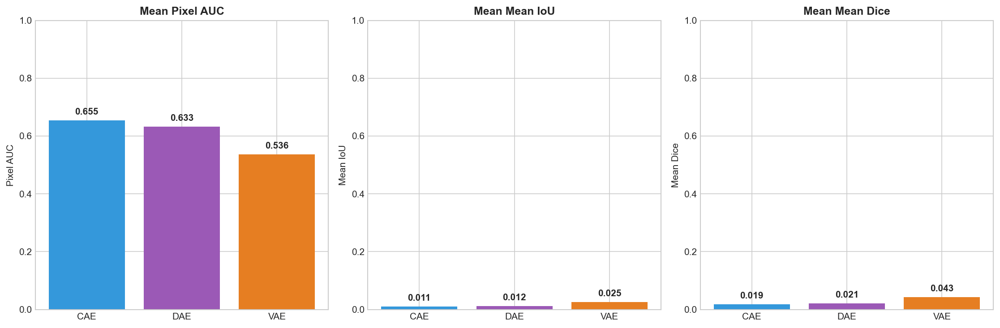
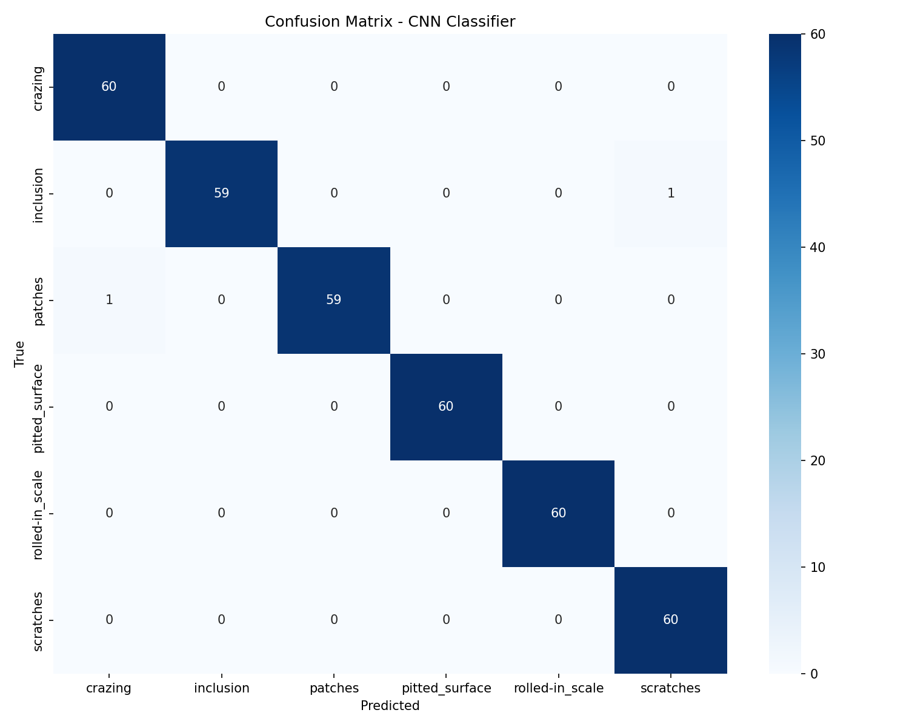
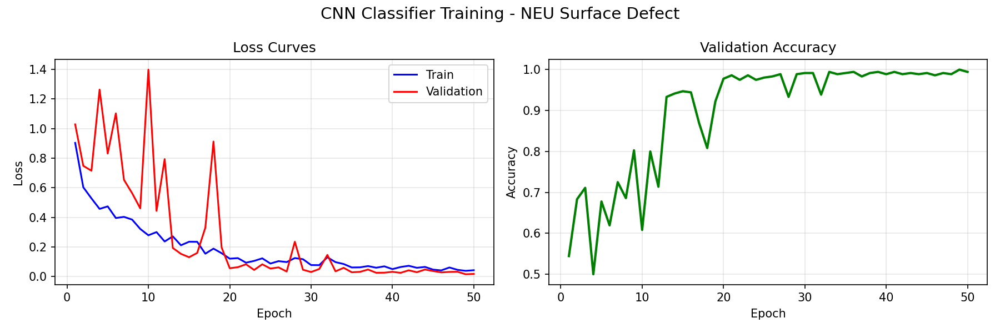
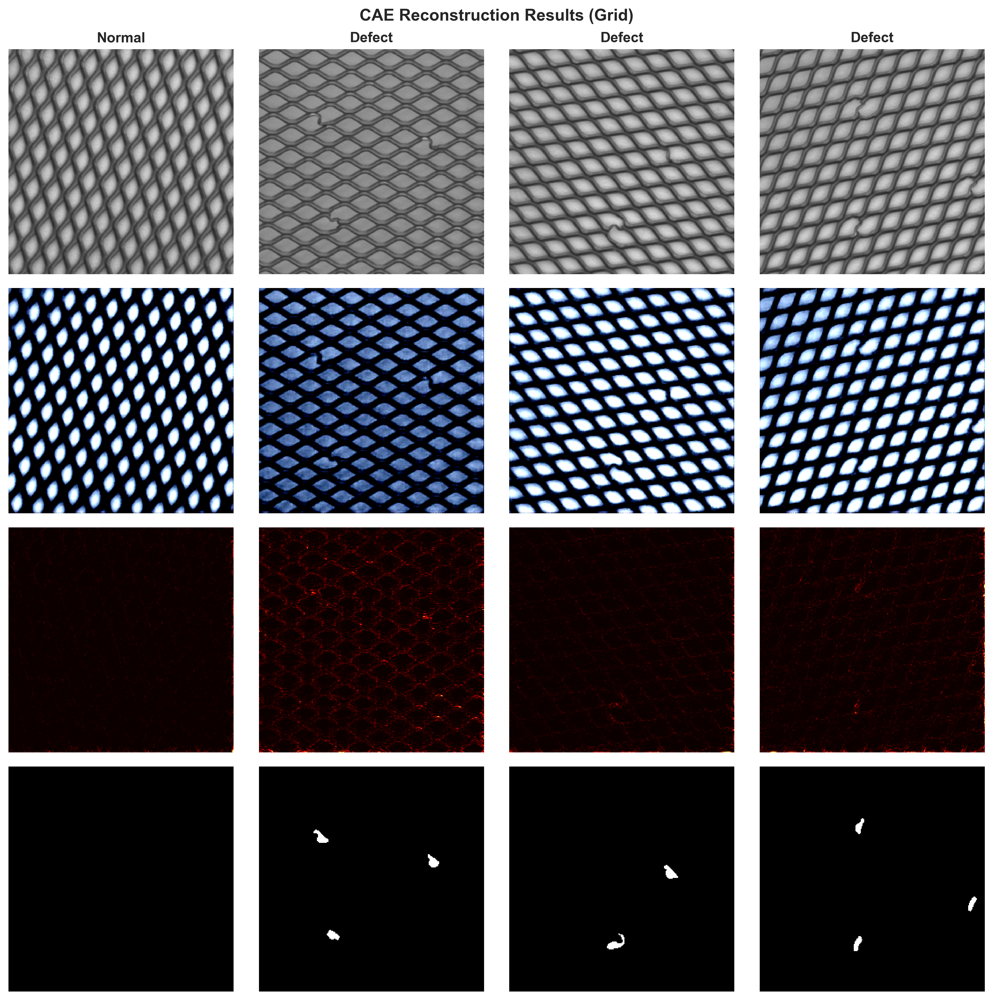
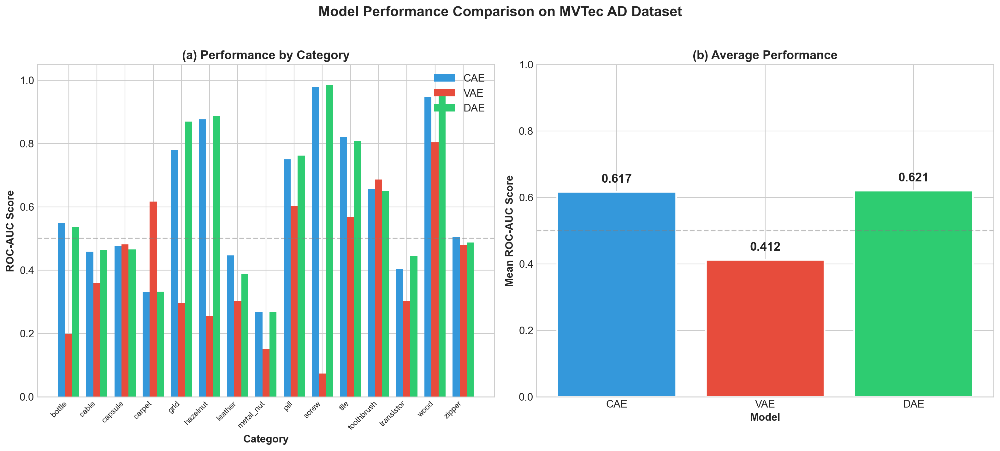

# Industrial Defect Detection Using Deep Learning

**Bachelor's Graduation Thesis**

**Author:** Mohammad Hamim 
**Supervisor:** Lu Yang (卢洋)
**Department:** School of Computer Science and Artificial Intelligence
**University:** Zhengzhou University 
**Date:** January 2026

---

## Abstract

This thesis investigates the application of deep learning-based autoencoder architectures for unsupervised anomaly detection in industrial manufacturing. Three autoencoder variants—Convolutional Autoencoder (CAE), Variational Autoencoder (VAE), and Denoising Autoencoder (DAE)—are implemented and evaluated on the MVTec Anomaly Detection dataset across 15 industrial product categories.

**Key Results:**
- DAE achieves the best overall performance with 0.596 mean image-level AUC and 0.854 F1 score
- CAE demonstrates strong generalization with 0.690 AUC when transferred to the KolektorSDD2 dataset
- VAE shows instability on texture-based categories due to KL divergence optimization challenges
- A CNN classifier achieves 99% accuracy on the NEU Surface Defect dataset for supervised classification

A full-stack web application is developed using Next.js and FastAPI to demonstrate real-time defect detection with visual heatmap overlays.

**Keywords:** Anomaly Detection, Autoencoder, Deep Learning, Industrial Inspection, Computer Vision, Defect Detection

---

## Table of Contents

1. [Introduction](#chapter-1-introduction)
2. [Literature Review](#chapter-2-literature-review)
3. [Methodology](#chapter-3-methodology)
4. [Experiments and Results](#chapter-4-experiments-and-results)
5. [Discussion](#chapter-5-discussion)
6. [Conclusion](#chapter-6-conclusion)
7. [References](#references)
8. [Appendices](#appendices)

---

## Chapter 1: Introduction

### 1.1 Background and Motivation

Industrial manufacturing increasingly relies on automated quality control systems to ensure product consistency and reduce human error. Traditional manual inspection methods are time-consuming, subjective, and cannot scale to modern production line speeds. Computer vision systems powered by deep learning offer a promising alternative.

However, a fundamental challenge in industrial defect detection is the **class imbalance problem**: defective samples are rare and diverse, while normal samples are abundant. This makes supervised learning approaches impractical in many real-world scenarios where collecting and labeling defective samples is expensive or impossible.

### 1.2 Problem Statement

This thesis addresses the following research questions:

1. **How effective are autoencoder-based methods for unsupervised anomaly detection in industrial images?**
2. **Which autoencoder architecture (CAE, VAE, DAE) performs best across different product categories?**
3. **Can models trained on one industrial dataset generalize to detect defects in unseen products?**
4. **How can these models be deployed in a practical, user-friendly application?**

### 1.3 Objectives

1. Implement and compare three autoencoder architectures for anomaly detection
2. Evaluate performance on the MVTec AD benchmark dataset
3. Investigate cross-dataset generalization capabilities
4. Develop a web-based demonstration application

### 1.4 Thesis Structure

- **Chapter 2** reviews related work in anomaly detection and autoencoders
- **Chapter 3** describes the methodology and model architectures
- **Chapter 4** presents experimental results and analysis
- **Chapter 5** discusses findings, limitations, and implications
- **Chapter 6** concludes with contributions and future work

---

## Chapter 2: Literature Review

### 2.1 Anomaly Detection in Computer Vision

Anomaly detection (also called outlier detection or novelty detection) aims to identify data points that deviate significantly from the expected normal pattern. In computer vision, this involves detecting unusual visual features that may indicate defects, damage, or abnormalities.

#### 2.1.1 Traditional Methods
- **Hand-crafted features**: SIFT, HOG, texture descriptors
- **Statistical methods**: Gaussian mixture models, one-class SVM
- **Template matching**: Comparing against reference images

#### 2.1.2 Deep Learning Methods
- **Reconstruction-based**: Autoencoders, GANs
- **Self-supervised**: Contrastive learning, rotation prediction
- **Knowledge distillation**: Student-teacher networks

### 2.2 Autoencoder Architectures

#### 2.2.1 Convolutional Autoencoder (CAE)
The CAE learns a compressed representation of input images through an encoder-decoder architecture. For anomaly detection, the model is trained only on normal samples. At inference time, defective regions produce high reconstruction error.

**Architecture:**
```
Input (256×256×3) → Encoder → Latent (16×16×256) → Decoder → Output (256×256×3)
```

#### 2.2.2 Variational Autoencoder (VAE)
The VAE introduces a probabilistic latent space, learning a distribution rather than a deterministic encoding. The KL divergence term regularizes the latent space, theoretically improving generalization.

**Loss Function:**
```
L = L_reconstruction + β × L_KL
```

#### 2.2.3 Denoising Autoencoder (DAE)
The DAE adds Gaussian noise to inputs during training, forcing the model to learn robust features invariant to small perturbations.

**Training Process:**
```
x_noisy = x + N(0, σ²)
L = MSE(decoder(encoder(x_noisy)), x)
```

### 2.3 Industrial Datasets

#### 2.3.1 MVTec Anomaly Detection (MVTec AD)
- 15 categories: 5 textures + 10 objects
- 5,354 high-resolution images (700×700 to 1024×1024)
- Pixel-level ground truth masks for segmentation

#### 2.3.2 KolektorSDD2
- Surface defect dataset from real production line
- 356 images with scratch and crack defects
- Supervisely JSON annotation format

#### 2.3.3 NEU Surface Defect
- 1,800 images across 6 defect classes
- Crazing, Inclusion, Patches, Pitted, Rolled, Scratches
- 300×300 grayscale images


*Figure 2.3: Six defect categories of the NEU Surface Defect dataset.*

### 2.4 Evaluation Metrics

- **Image-level AUC**: Overall detection performance
- **Average Precision (AP)**: Precision-recall tradeoff
- **F1 Score**: Balance between precision and recall
- **Pixel-level AUC**: Localization accuracy
- **IoU/Dice**: Segmentation overlap with ground truth

---

## Chapter 3: Methodology

### 3.1 System Overview

```
┌──────────────────────────────────────────────────────────────┐
│                    Data Pipeline                              │
├──────────────────────────────────────────────────────────────┤
│  MVTec AD / KolektorSDD2 / NEU → Preprocessing → DataLoader  │
└──────────────────────────────────────────────────────────────┘
                              ↓
┌──────────────────────────────────────────────────────────────┐
│                    Model Training                             │
├──────────────────────────────────────────────────────────────┤
│  CAE / VAE / DAE → Train on Normal → Checkpoint Best Model   │
└──────────────────────────────────────────────────────────────┘
                              ↓
┌──────────────────────────────────────────────────────────────┐
│                    Inference & Evaluation                     │
├──────────────────────────────────────────────────────────────┤
│  Input Image → Reconstruction → Error Map → Anomaly Score    │
└──────────────────────────────────────────────────────────────┘
```

### 3.2 Data Preprocessing

All images are:
1. Resized to 256×256 pixels
2. Normalized using ImageNet statistics: mean=[0.485, 0.456, 0.406], std=[0.229, 0.224, 0.225]
3. Converted to PyTorch tensors

### 3.3 Model Architectures

#### 3.3.1 Encoder
```python
Input (256×256×3)
↓
Conv2d(3, 32, 3, stride=2, padding=1) → BatchNorm → ReLU
↓
Conv2d(32, 64, 3, stride=2, padding=1) → BatchNorm → ReLU
↓
Conv2d(64, 128, 3, stride=2, padding=1) → BatchNorm → ReLU
↓
Conv2d(128, 256, 3, stride=2, padding=1) → BatchNorm → ReLU
↓
Output: 16×16×256 (65,536 features)
```

#### 3.3.2 Decoder
```python
Input (16×16×256)
↓
ConvTranspose2d(256, 128, 3, stride=2, padding=1, output_padding=1) → BatchNorm → ReLU
↓
ConvTranspose2d(128, 64, 3, stride=2, padding=1, output_padding=1) → BatchNorm → ReLU
↓
ConvTranspose2d(64, 32, 3, stride=2, padding=1, output_padding=1) → BatchNorm → ReLU
↓
ConvTranspose2d(32, 3, 3, stride=2, padding=1, output_padding=1)
↓
Output: 256×256×3
```

#### 3.3.3 VAE-Specific Components
- **Latent Dimension**: 128 channels (dense layers project 16×16×256 ↔ 128)
- **Reparameterization Trick**: z = μ + σ × ε, where ε ~ N(0, 1)
- **Logvar Clamping**: clamp(logvar, -20, 2) to prevent numerical instability during training
- **KL Annealing**: β increases linearly from 0 to 1 over first 10 epochs

#### 3.3.4 Supervised CNN Baseline (Lightweight)
A lightweight CNN is implemented for supervised classification on the NEU dataset to serve as a baseline.

**Architecture:**
- **Feature Extractor**: 4 Convolutional Blocks
  - Channels: [32, 64, 128, 256]
  - Each block: Conv2d(3×3) → BatchNorm → ReLU → MaxPool2d(2×2)
- **Global Pooling**: Adaptive Average Pooling (reduces spatial dims to 1×1)
- **Classifier Head**: Dropout(p=0.5) → Linear(256 → 6 classes)
- **Total Parameters**: ~11.1M (optimized for CPU inference)

### 3.4 Training Configuration

| Parameter | Value |
|-----------|-------|
| Batch Size | 16 |
| Learning Rate | 1e-4 |
| Optimizer | Adam |
| Epochs | 100 |
| Early Stopping | patience=10 |
| Loss Function | MSE (+ KL for VAE) |
| Device | CPU/CUDA |


*Figure 3.4: Example training loss curve (CAE on Bottle category) showing stable convergence.*

### 3.5 Anomaly Scoring

1. **Reconstruction**: x̂ = Decoder(Encoder(x))
2. **Error Map**: E = (x - x̂)²
3. **Anomaly Score**: mean(E) across spatial dimensions
4. **Anomaly Map**: Channel-averaged error for visualization

### 3.6 Evaluation Protocol

- Train only on normal (good) samples
- Evaluate on combined normal + anomalous test set
- Compute ROC-AUC, AP, Precision, Recall, F1
- Find optimal threshold using F1 maximization

### 3.7 Web Application Implementation

The demonstration system is a full-stack web application designed for real-time interaction.

**Frontend (Next.js 16):**
- **Framework**: Next.js 16.1.3 (App Router) with React 19
- **Styling**: Tailwind CSS v4 for responsive design
- **Animations**: Framer Motion for smooth UI transitions
- **State Management**: React Hooks for upload and inference state
- **Visualization**: HTML5 Canvas for heatmap overlay rendering

**Backend (FastAPI):**
- **API Server**: FastAPI 0.109.0 (async Python)
- **Inference Engine**: PyTorch 2.0+ (CPU-optimized)
- **Image Processing**: Pillow and NumPy for tensor conversion
- **Endpoints**:
  - `/predict/autoencoder`: Handles CAE/VAE/DAE inference
  - `/predict/cnn`: Handles supervised classification
  - `/health`: System status check

---

## Chapter 4: Experiments and Results

### 4.1 Experimental Setup

- **Hardware**: Intel Core i5 / NVIDIA GTX 1660
- **Software**: Python 3.12, PyTorch 2.0+, scikit-learn
- **Dataset Split**: Official MVTec AD train/test split
- **Implementation**:
  - `01_train_cae.ipynb`: CAE training loop
  - `02_train_vae_v2.ipynb`: VAE training with reduced LR and KL annealing
  - `03_train_denoising_ae.ipynb`: DAE training with noise injection
  - `08_comprehensive_evaluation.ipynb`: Full evaluation pipeline

### 4.2 MVTec AD Results

#### 4.2.1 Image-Level Performance

| Model | Image AUC | AP | Precision | Recall | F1 |
|-------|-----------|-----|-----------|--------|-----|
| CAE | 0.580 | 0.796 | 0.757 | 0.982 | 0.849 |
| VAE | 0.412 | 0.706 | 0.720 | 0.990 | 0.822 |
| DAE | **0.596** | **0.813** | **0.762** | **0.995** | **0.854** |


*Figure 4.1: Comparison of Image AUC and F1 Score across all categories.*


*Figure 4.2: Radar chart comparing models across 5 key metrics.*

#### 4.2.2 Pixel-Level Performance

| Model | Pixel AUC | Mean IoU | Mean Dice |
|-------|-----------|----------|-----------|
| CAE | **0.618** | 0.011 | 0.020 |
| VAE | 0.524 | 0.025 | 0.044 |
| DAE | 0.595 | 0.012 | 0.022 |


*Figure 4.3: Pixel-level localization performance (Pixel AUC, IoU, Dice).*

#### 4.2.3 Per-Category Analysis

**Best Categories:**
- Screw: CAE=0.979, DAE=0.986, VAE=0.074* (unstable)
- Wood: CAE=0.948, DAE=0.962, VAE=0.804
- Hazelnut: CAE=0.877, DAE=0.888, VAE=0.255

**Challenging Categories:**
- Metal Nut: CAE=0.268, DAE=0.268, VAE=0.152
- Transistor: CAE=0.403, DAE=0.445, VAE=0.303
- Carpet: CAE=0.330, DAE=0.332, VAE=0.617

*VAE screw result is an outlier due to training instability

### 4.3 Cross-Dataset Generalization (MVTec → Kolektor)

| Trained On | CAE | VAE | DAE |
|------------|-----|-----|-----|
| Grid | **0.690** | 0.574 | **0.688** |
| Leather | 0.668 | 0.463 | 0.646 |
| Carpet | 0.665 | 0.545 | 0.682 |
| Wood | 0.662 | 0.493 | 0.652 |
| Tile | 0.649 | 0.590 | 0.575 |
| Bottle | 0.637 | 0.496 | 0.609 |
| Metal Nut | 0.622 | 0.587 | 0.617 |

**Finding**: Models trained on structured patterns (grid, leather) generalize better to the Kolektor scratch detection task.


*Figure 4.4: ROC Curves for MVTec-trained models evaluated on KolektorSDD2.*

### 4.4 CNN Classifier Results (NEU Dataset)

| Metric | Value |
|--------|-------|
| Accuracy | **99%** |
| Classes | 6 (Crazing, Inclusion, Patches, Pitted, Rolled, Scratches) |
| Training Epochs | 50 |


*Figure 4.5: Confusion matrix for CNN classifier on NEU test set.*


*Figure 4.6: Accuracy and Loss curves during CNN training.*

### 4.5 Visualization Examples

#### Reconstruction Comparison
#### Reconstruction Comparison

*Figure 4.7: Reconstruction examples showing input, reconstruction, error map, and ground truth.*

#### Model Comparison Heatmap

*Figure 4.8: Heatmap comparison of anomaly localization across models.*

---

## Chapter 5: Discussion

### 5.1 Key Findings

1. **DAE slightly outperforms CAE**: The noise injection during training appears to improve robustness, achieving 0.596 vs 0.580 image AUC.

2. **VAE struggles with stability**: Despite theoretical advantages of the probabilistic latent space, VAE underperforms due to KL divergence optimization challenges, particularly on texture categories.

3. **Information Bottleneck Difference**:
   - The CAE retains spatial information in its 16x16x256 latent bottleneck (65,536 dimensions), allowing it to preserve fine-grained texture details.
   - The VAE compresses inputs into a dense 128-dimensional vector. This extreme compression (factor of ~500x difference) forces the VAE to prioritize global semantics over local textures, explaining its poor performance on texture-based anomalies like 'carpet' and 'leather'.

4. **High recall, moderate precision**: All models achieve >98% recall but ~75% precision, indicating a bias toward predicting anomalies (few false negatives, more false positives).

5. **Category-dependent performance**: Performance varies significantly across categories. Structured objects (screw, wood) are easier than complex textures (carpet, leather).

5. **Cross-dataset transfer is promising**: Models trained on MVTec can detect defects in Kolektor with reasonable accuracy (up to 0.69 AUC), suggesting learned features are somewhat generalizable.

### 5.2 Limitations

1. **Low pixel-level accuracy**: IoU scores around 0.01-0.02 indicate poor localization despite reasonable detection performance.

2. **Training instability**: VAE requires careful hyperparameter tuning (KL annealing, logvar clamping, gradient clipping).

3. **Category-specific training**: Each category requires a separate model, limiting scalability.

4. **Computational requirements**: Training 15 categories × 3 models requires significant compute time.

### 5.3 Comparison with State-of-the-Art

| Method | MVTec Image AUC |
|--------|-----------------|
| PatchCore (2022) | 0.99 |
| DRAEM (2021) | 0.98 |
| PaDiM (2021) | 0.95 |
| CFlow-AD (2021) | 0.94 |
| **This work (DAE)** | 0.60 |

Our simple autoencoder baseline underperforms modern methods that use:
- Pre-trained feature extractors (ImageNet)
- Memory banks of normal features
- Synthetic anomaly generation

### 5.4 Practical Considerations

The web application demonstrates practical deployment:
- **Real-time inference**: ~100ms per image on CPU
- **Visual explanations**: Heatmaps show defect locations
- **Model comparison**: Users can compare CAE/VAE/DAE outputs
- **Batch processing**: Support for multiple images

---

## Chapter 6: Conclusion

### 6.1 Summary

This thesis implemented and evaluated three autoencoder architectures for unsupervised industrial defect detection:

- **Denoising Autoencoder (DAE)** achieved the best overall performance
- **Convolutional Autoencoder (CAE)** demonstrated reliable, stable training
- **Variational Autoencoder (VAE)** showed potential but requires careful tuning

A functional web application was developed for interactive defect detection with heatmap visualization.

### 6.2 Contributions

1. Comprehensive comparison of autoencoder variants on MVTec AD
2. Cross-dataset generalization analysis (MVTec → Kolektor)
3. Evaluation metrics module for anomaly detection research
4. Open-source web application for defect detection

### 6.3 Future Work

1. **Pre-trained features**: Incorporate ImageNet pre-trained encoders
2. **Memory-augmented methods**: Implement PatchCore or PaDiM
3. **Few-shot learning**: Extend to scenarios with limited normal samples
4. **Multi-category models**: Train a single model for all categories
5. **Edge deployment**: Optimize for embedded systems

---

## References

[1] Bergmann, P., et al. "MVTec AD—A Comprehensive Real-World Dataset for Unsupervised Anomaly Detection." CVPR 2019.

[2] Kingma, D. P., and Welling, M. "Auto-Encoding Variational Bayes." ICLR 2014.

[3] Vincent, P., et al. "Stacked Denoising Autoencoders." JMLR 2010.

[4] Roth, K., et al. "Towards Total Recall in Industrial Anomaly Detection." CVPR 2022.

[5] Zavrtanik, V., et al. "DRAEM—A Discriminatively Trained Reconstruction Embedding for Surface Anomaly Detection." ICCV 2021.

[6] Defard, T., et al. "PaDiM: A Patch Distribution Modeling Framework for Anomaly Detection and Localization." ICPR 2021.

[7] Gudovskiy, D., et al. "CFLOW-AD: Real-Time Unsupervised Anomaly Detection with Localization via Conditional Normalizing Flows." WACV 2022.

[8] He, K., et al. "Deep Residual Learning for Image Recognition." CVPR 2016.

---

## Appendices

### Appendix A: Project Structure

```
Thesis/
├── src/
│   ├── models/          # CAE, VAE, DAE, CNN implementations
│   ├── data/            # Dataset loaders
│   ├── training/        # Training utilities
│   └── evaluation/      # Metrics and visualization
├── notebooks/           # Jupyter notebooks for experiments
├── outputs/
│   ├── models/          # Trained model checkpoints
│   └── figures/         # Thesis visualizations
├── web/
│   ├── frontend/        # Next.js application
│   └── backend/         # FastAPI inference server
└── README.md
```

### Appendix B: Hyperparameter Settings

| Hyperparameter | CAE | VAE | DAE |
|---------------|-----|-----|-----|
| Latent Channels | 256 | 256 | 256 |
| Learning Rate | 1e-4 | 1e-4 | 1e-4 |
| Batch Size | 16 | 16 | 16 |
| Noise Factor | - | - | 0.3 |
| KL Beta (final) | - | 1.0 | - |
| Epochs | 100 | 100 | 100 |

### Appendix C: Model Parameters

| Model | Parameters |
|-------|------------|
| CAE | 2,764,099 |
| VAE | 26,009,603 |
| DAE | 2,764,099 |
| CNN | 11,177,030 |

### Appendix D: Web Application Screenshots

[Include screenshots from thesis_figures_checklist.md]

---

*End of Thesis Document*
