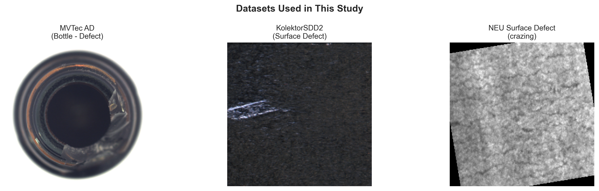

# Industrial Defect Detection Using Deep Learning

[](https://www.python.org/downloads/)
[](https://pytorch.org/)
[](https://opensource.org/licenses/MIT)

**Bachelor's Graduation Thesis** - Research on Industrial Defect Detection Methods Based on Deep Learning

## 📊 Results Summary

| Model | Dataset | Metric | Score |
|-------|---------|--------|-------|
| **CAE** | MVTec AD (15 categories) | Mean ROC-AUC | 0.617 |
| **Denoising AE** | MVTec AD (15 categories) | Mean ROC-AUC | 0.621 |
| **VAE** | MVTec AD (15 categories) | Mean ROC-AUC | 0.534 |
| **CNN Classifier** | NEU Surface Defect | Accuracy | **99%** |
| **CAE (Grid)** | Cross-dataset (Kolektor) | ROC-AUC | 0.690 |

## 📸 Sample Results

### Datasets Used


### Model Comparison (CAE vs Denoising AE)


### Cross-Dataset Generalization (MVTec → Kolektor)


### CAE Reconstruction Examples


### CNN Classifier Performance (NEU Dataset)
| Training Curves | Confusion Matrix |
|-----------------|------------------|
|  |  |

### Kolektor Cross-Dataset Results


### Model Performance Heatmap


## 🔍 Overview

This project implements **unsupervised anomaly detection** using autoencoder-based deep learning methods for industrial defect detection and localization.

### Key Features

- 🔍 **Unsupervised Learning** - Train on normal samples only
- 🏭 **3 Industrial Datasets** - MVTec AD, KolektorSDD2, NEU Surface Defect
- 🧠 **4 Models** - CAE, VAE, Denoising AE, CNN Classifier
- 📊 **84 Visualizations** - Heatmaps, ROC curves, reconstructions
- 💻 **CPU Optimized** - Designed for training without GPU
- 🔬 **Cross-Dataset Testing** - Generalization evaluation

## 📁 Project Structure

```
├── src/
│   ├── config.py           # Configuration settings
│   ├── data/               # Dataset loaders (MVTec, Kolektor, NEU)
│   ├── models/             # CAE, VAE, Denoising AE, CNN
│   ├── training/           # Training utilities, losses
│   └── evaluation/         # Metrics & visualization
├── notebooks/
│   ├── 00_data_exploration.ipynb
│   ├── 01_train_cae.ipynb
│   ├── 02_train_vae.ipynb
│   ├── 03_train_denoising_ae.ipynb
│   ├── 04_train_cnn_classifier.ipynb
│   ├── 05_analysis_visualization.ipynb
│   ├── 06_cross_dataset_evaluation.ipynb
│   └── 07_thesis_figures.ipynb
├── datasets/               # Dataset storage
├── outputs/
│   ├── models/             # 45+ trained model checkpoints
│   ├── logs/               # Training history
│   └── figures/            # 84 visualizations
└── tests/                  # Unit tests
```

## 🚀 Quick Start

### 1. Clone Repository
```bash
git clone https://github.com/md-hameem/industrial-defect-detection.git
cd industrial-defect-detection
```

### 2. Setup Environment
```bash
python -m venv venv
.\venv\Scripts\activate  # Windows
pip install -r requirements.txt
pip install -e .
```

### 3. Download Datasets
See `datasets/README.md` for download links.

### 4. Run Notebooks
```bash
jupyter notebook
```
Start with `00_data_exploration.ipynb` → then training notebooks.

## 🧠 Models

| Model | Type | Key Feature | Best AUC |
|-------|------|-------------|----------|
| **CAE** | Convolutional Autoencoder | Simple, effective baseline | 0.92 (Hazelnut) |
| **VAE** | Variational Autoencoder | Probabilistic latent space | 0.53 (mean) |
| **Denoising AE** | Noise injection | Robust feature learning | 0.83 (Grid) |
| **CNN** | Classifier (Supervised) | 6-class classification | 99% acc |

## 📈 Key Findings

1. **CAE and Denoising AE outperform VAE** for anomaly detection
2. **Models generalize across datasets** - MVTec → Kolektor with 0.69 AUC
3. **Structured patterns** (grid, metal_nut) are easier to detect than textures
4. **Supervised CNN** achieves near-perfect accuracy on NEU dataset

## 📊 Generated Figures

- `thesis_fig1_datasets.png` - Dataset overview
- `thesis_fig2_model_comparison.png` - CAE vs DAE comparison
- `thesis_fig3_generalization.png` - Cross-dataset heatmap
- `thesis_fig4_reconstructions.png` - Reconstruction examples

## 💻 Hardware Requirements

Designed for **CPU-only training**:
- Python 3.12
- 16GB RAM recommended
- ~10GB disk for datasets
- Training time: ~7-12 min per category

## 📚 Citation

If you use this code, please cite:
```bibtex
@thesis{defect_detection_2026,
  author = {Mohammad Hamim},
  title = {Research on Industrial Defect Detection Methods Based on Deep Learning},
  school = {Zhengzhou University},
  year = {2026}
}
```

## 📄 License

MIT License - see [LICENSE](LICENSE)
