# Industrial Defect Detection Using Deep Learning

[](https://www.python.org/downloads/)
[](https://pytorch.org/)
[](https://nextjs.org/)
[](https://fastapi.tiangolo.com/)
[](https://opensource.org/licenses/MIT)
[](CHANGELOG.md)
[](docs/thesis_paper.md)

**Bachelor's Graduation Thesis** - Research on Industrial Defect Detection Methods Based on Deep Learning

## 🌐 Web Application

A stunning, 3D-inspired full-stack web application for interactive defect detection featuring glassmorphism UI, animated gradient effects, and deep OLED-dark aesthetics:

### Homepage
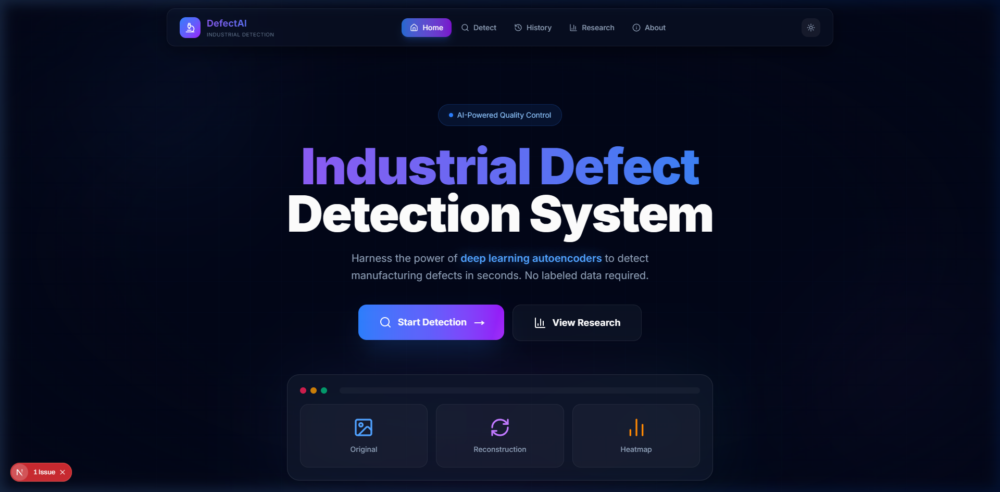

### Homepage — Stats & Workflow
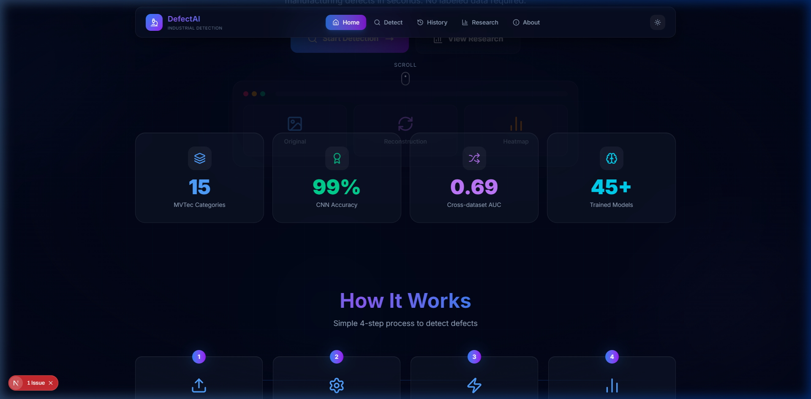

### Detection Page — AI-Powered Analysis
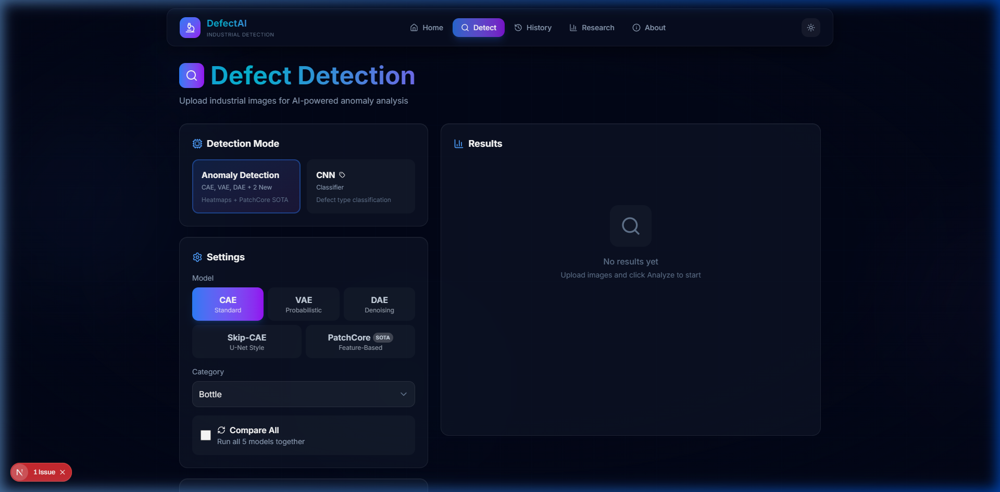

### Research Results — Data Visualization
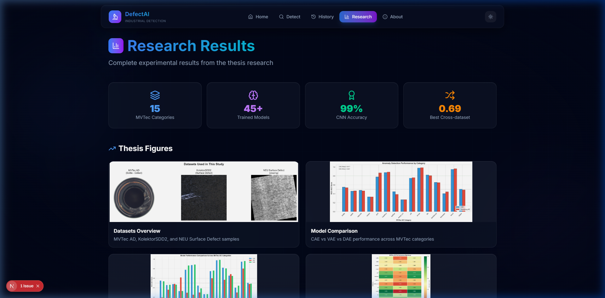

### About — Project Overview
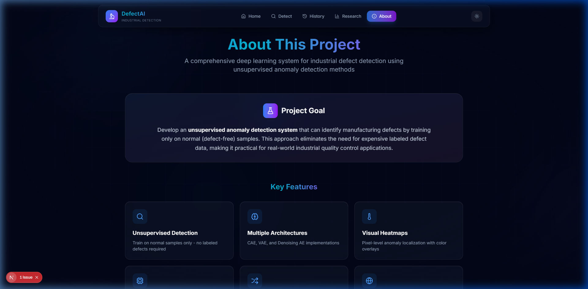

### Features
- 🔍 **Real-time Detection** - Upload images and get instant AI analysis
- 🧠 **6 AI Models** - CAE, VAE, DAE, Skip-CAE, PatchCore (SOTA), CNN
- 🌡️ **Visual Heatmaps** - Gaussian-smoothed anomaly maps + SSIM scoring
- 📊 **Compare All Models** - Side-by-side 5-model comparison with batch API
- 🌓 **Dark/Light Mode** - Full theme support with glassmorphism
- 📜 **History Tracking** - Keep track of all predictions
- ✨ **3D Effects** - CSS perspective transforms, glow borders, animated gradients

### Quick Start
```bash
# Backend (port 8000)
cd web/backend
pip install -r requirements.txt
uvicorn main:app --reload --port 8000

# Frontend (port 3000)
cd web/frontend
npm install
npm run dev
```
Open http://localhost:3000

---

## 📊 Results Summary

| Model | Dataset | Image AUC | AP | F1 | Pixel AUC |
|-------|---------|-----------|-----|-----|-----------|
| **PatchCore** | MVTec AD (15 categories) | **0.632** | 0.810 | 0.850 | - |
| **DAE** | MVTec AD (15 categories) | 0.596 | **0.813** | **0.854** | 0.595 |
| **Skip-CAE** | MVTec AD (15 categories) | 0.594 | 0.799 | 0.851 | - |
| **CAE** | MVTec AD (15 categories) | 0.580 | 0.796 | 0.849 | **0.618** |
| **VAE** | MVTec AD (15 categories) | 0.412 | 0.706 | 0.822 | 0.524 |
| **CNN Classifier** | NEU Surface Defect | - | - | **99%** | - |
| **CAE (Grid)** | Cross-dataset (Kolektor) | 0.690 | - | - | - |

## 📸 Sample Results

### Datasets Used
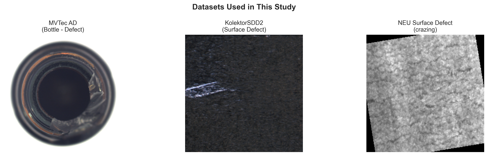

### Model Comparison (CAE vs Denoising AE)
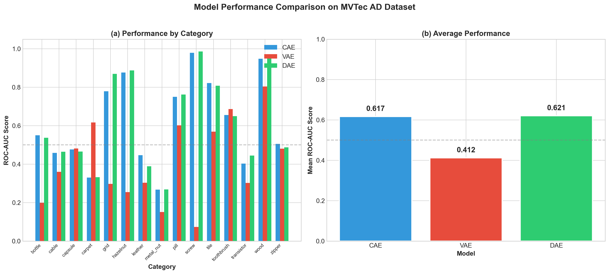

### Cross-Dataset Generalization (MVTec → Kolektor)
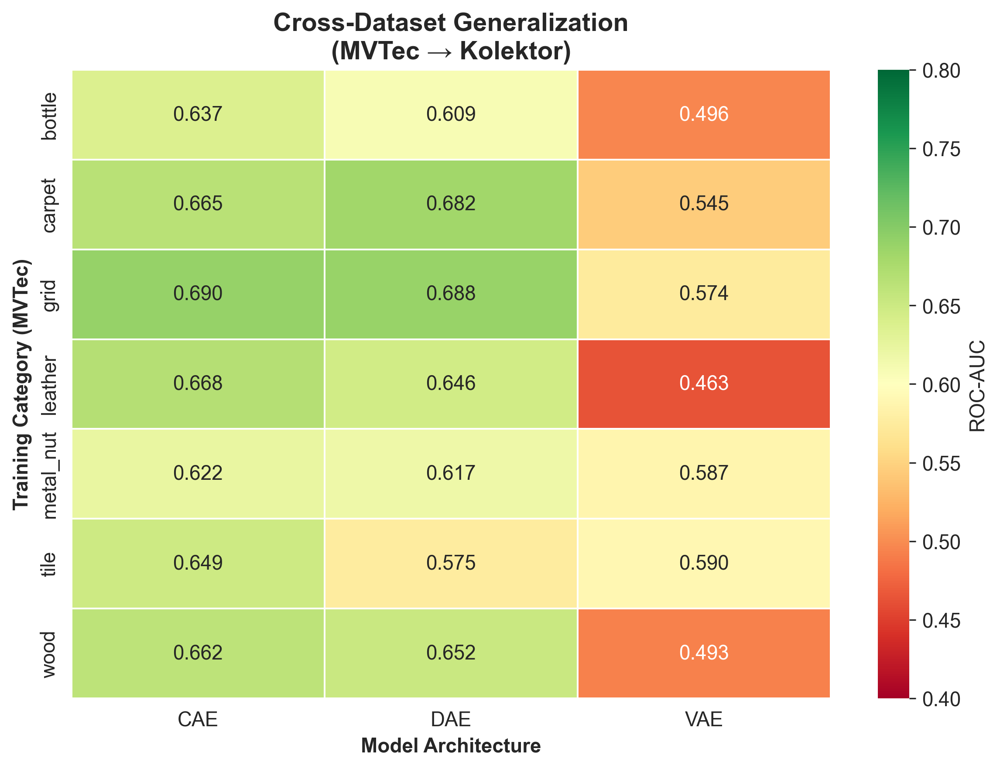

### CAE Reconstruction Examples
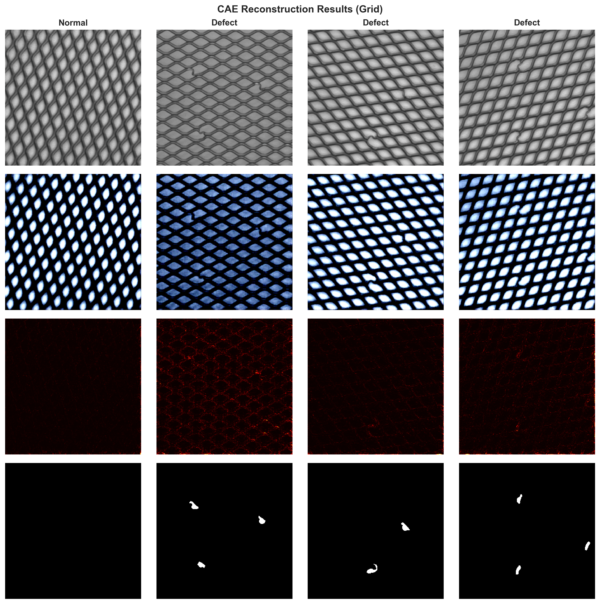

### CNN Classifier Performance (NEU Dataset)
| Training Curves | Confusion Matrix |
|-----------------|------------------|
| 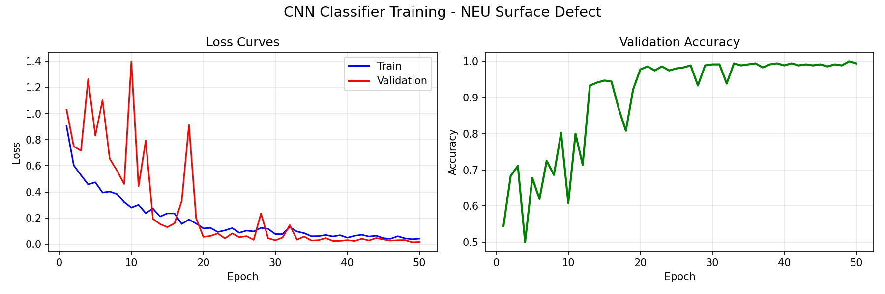 | 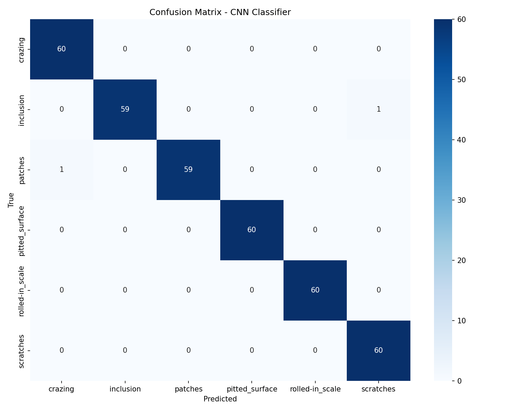 |

## 🔍 Overview

This project implements **unsupervised anomaly detection** using autoencoder-based deep learning methods for industrial defect detection and localization.

### Key Features

- 🔍 **Unsupervised Learning** - Train on normal samples only
- 🏭 **3 Industrial Datasets** - MVTec AD, KolektorSDD2, NEU Surface Defect
- 🧠 **6 Models** - CAE, VAE, Denoising AE, Skip-CAE (U-Net), PatchCore (SOTA), CNN Classifier
- 🌐 **Full-Stack Web App** - Next.js + FastAPI with batch inference API
- 📊 **84 Visualizations** - Heatmaps, ROC curves, reconstructions
- 💻 **CPU Optimized** - Designed for training without GPU (auto-detects CUDA)
- 🔬 **Cross-Dataset Testing** - Generalization evaluation
- 🧪 **44 Unit Tests** - Comprehensive model and metric test coverage
- 🔒 **Security** - Env-based secrets, input validation, secure model loading

## 📁 Project Structure

```
├── docs/               # Thesis documentation and figures
├── src/
│   ├── config.py           # Configuration settings
│   ├── data/               # Dataset loaders (MVTec, Kolektor, NEU)
│   ├── models/             # CAE, VAE, Denoising AE, CNN
│   ├── training/           # Training utilities, losses
│   └── evaluation/         # Metrics & visualization
├── web/
│   ├── backend/            # FastAPI inference server
│   │   ├── main.py         # API endpoints
│   │   └── inference.py    # Model loading & prediction
│   └── frontend/           # Next.js React application
│       ├── src/app/        # Pages (detect, research, about, history)
│       └── src/components/ # Navbar, Footer, ClientLayout
├── notebooks/
│   ├── 00_data_exploration.ipynb
│   ├── 01_train_cae.ipynb
│   ├── 02_train_vae.ipynb
│   ├── 03_train_denoising_ae.ipynb
│   ├── 04_train_cnn_classifier.ipynb
│   ├── 05_analysis_visualization.ipynb
│   ├── 06_cross_dataset_evaluation.ipynb
│   └── 07_thesis_figures.ipynb
├── datasets/               # Dataset storage
├── outputs/
│   ├── models/             # 45+ trained model checkpoints
│   ├── logs/               # Training history
│   └── figures/            # 84 visualizations
└── tests/                  # Unit tests
```

## 🚀 Quick Start

### 1. Clone Repository
```bash
git clone https://github.com/md-hameem/industrial-defect-detection.git
cd industrial-defect-detection
```

### 2. Setup Environment
```bash
python -m venv venv
.\venv\Scripts\activate  # Windows
pip install -r requirements.txt
pip install -e .
```

### 3. Download Datasets
See `datasets/README.md` for download links.

### 4. Run Notebooks
```bash
jupyter notebook
```
Start with `00_data_exploration.ipynb` → then training notebooks.

### 5. Run Web Application
```bash
# Terminal 1: Backend
cd web/backend && uvicorn main:app --reload --port 8000

# Terminal 2: Frontend
cd web/frontend && npm run dev
```

## 🧠 Models

| Model | Type | Key Feature | Best AUC |
|-------|------|-------------|----------|
| **PatchCore** | Pretrained feature matching | SOTA, no training needed | 0.93 (Hazelnut) |
| **Skip-CAE** | U-Net style skip connections | Sharper anomaly maps | 0.96 (Wood) |
| **Denoising AE** | Noise injection | Robust feature learning | 0.99 (Screw) |
| **CAE** | Convolutional Autoencoder | Simple, effective baseline | 0.98 (Screw) |
| **VAE** | Variational Autoencoder | Probabilistic latent space | 0.80 (Wood) |
| **CNN** | Classifier (Supervised) | 6-class classification | 99% acc |

## 📈 Key Findings

1. **CAE and Denoising AE outperform VAE** for anomaly detection
2. **Models generalize across datasets** - MVTec → Kolektor with 0.69 AUC
3. **Structured patterns** (grid, metal_nut) are easier to detect than textures
4. **Information Bottleneck**: VAE's 128-dim vector bottleneck loses texture details compared to CAE's 65,536-dim spatial bottleneck.
5. **Supervised CNN** achieves near-perfect accuracy on NEU dataset

## 💻 Hardware Requirements

Designed for both **Local Testing** and **Cloud GPU Training**:

**Local Development:**
- Python 3.12, 16GB RAM recommended
- ~10GB disk for datasets

**Scalable Training (Kaggle Integration):**
- Refer to `11_train_skip_cae_kaggle.ipynb` & `12_train_patchcore_kaggle.ipynb`
- Leverages Kaggle Tesla T4 / P100 GPUs for OOM-free deep learning
- Fast inference directly feeds outputs into local `/models` web backend

## 👥 Authors

- **Mohammad Hamim** - Author - [GitHub](https://github.com/md-hameem) | [LinkedIn](https://linkedin.com/in/md-hameem)
- **Lu Yang (卢洋)** - Supervisor - Zhengzhou University, School of Computer Science - ieylu@zzu.edu.cn

## 📚 Citation

If you use this code, please cite:
```bibtex
@thesis{defect_detection_2026,
  author = {Mohammad Hamim},
  title = {Research on Industrial Defect Detection Methods Based on Deep Learning},
  school = {Zhengzhou University},
  year = {2026}
}
```

## 📄 License

MIT License - see [LICENSE](LICENSE)
